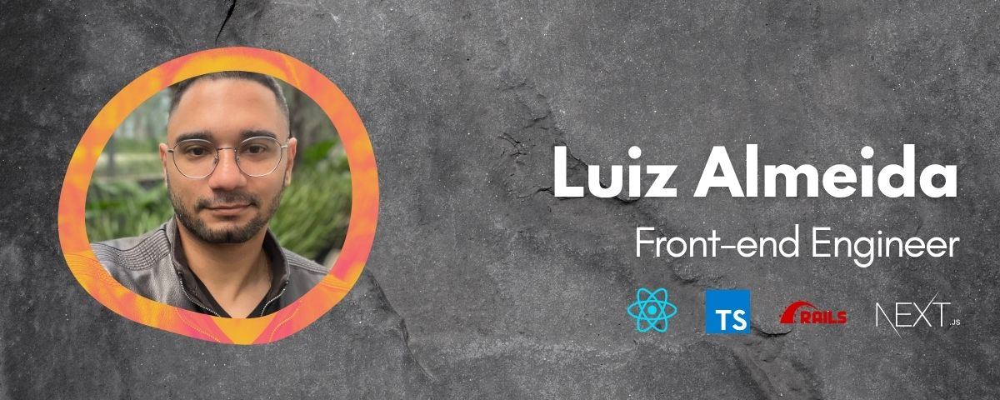

# 👋 Hey, I’m Luiz Almeida

**Senior Front-end Engineer** from 🇧🇷 Brazil with **10+ years of experience** building scalable and user-focused applications. I’ve shipped everything from SaaS platforms and mobile apps to CMSs and full-stack web systems — always with performance, clarity, and business goals in mind.

I move fast, think in components, and care deeply about code quality and user experience.

Currently looking for new challenges where I can help dynamic teams deliver outstanding digital products.

---

## 🛠️ Tech Stack & Tools

### **Languages**

### **Front-end**

### **Back-end & Infra**

### **Cloud & DevOps**

---

## 📊 GitHub Stats

  

  

---

## 💼 Highlights

- 🔁 Full-stack dev: from REST/GraphQL APIs to SSR and mobile apps
- 🚀 Published apps to the App Store & Play Store
- 🧠 Solid knowledge of front-end architecture and modern build tools
- ⚙️ Experience with CI/CD and scalable cloud deployments (AWS, Azure)
- 🧩 Built custom CMS with Strapi, WordPress and Rails
- 💰 Worked on a crypto ICO and large-scale SaaS redesign

---

## 🧑 Personal Life

When I’m not coding, you’ll find me:

- 🍳 Cooking something good
- 🪴 Growing plants
- 🥋 Practicing Brazilian Jiu-Jitsu (purple belt 💜)

---

## 💭 Favorite Quote

> You can avoid reality, but you cannot avoid the consequences of avoiding reality.  
> — **Ayn Rand**

---

## 📬 Let’s Connect

- [LinkedIn](https://www.linkedin.com/in/luizhrqas/)
- [E-mail](mailto:luizhrqas@gmail.com)
- [WhatsApp](https://api.whatsapp.com/send?phone=5551991031355&text=Hello!)
- [Instagram](https://www.instagram.com/lhas.js/)
- [Portfolio](https://lhas.io)
