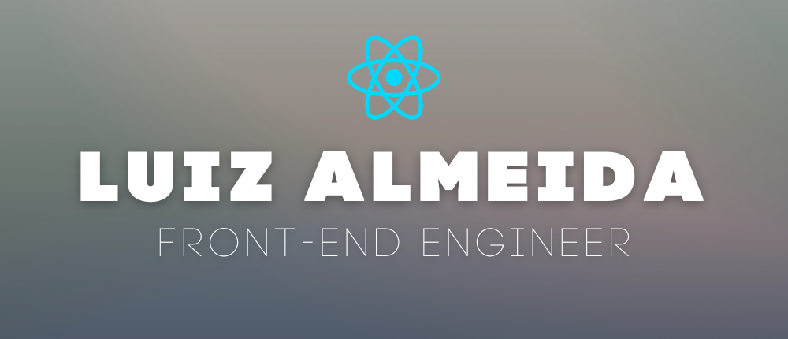

## Hello, there! 🙃

My name is Luiz Almeida and I'm a Front-end Engineer. I'm from Brazil, living in Porto Alegre, RS.

## 🖥️ Languages

## ⚙️ Technologies

## ✏️ Blog & Writing

Apart from coding, i write tech articles too - you can check my latest articles on [my website](https://blog.underdev.io/).

Some of my featured articles:

- [Publish your website in App Store and Play Store](https://blog.underdev.io/posts/transforme-seu-site-pwa-ou-nao-em-aplicativo/)
- [TypeScript: What is a Interface and How Should I Use Them?](https://blog.underdev.io/posts/usando-typescript-interfaces/)
- [How to Use Regular Expressions in JavaScript](https://blog.underdev.io/posts/usando-expressoes-regulares-javascript/)

## 🧑 Personal Life

I live with my wife and my daughter Ruby (yes, we called her with this name because of the programming language).

Also, I have 4 cats (Frida, Dali, Vampire and Little Noise). 🐱

My main hobby is practice Brazilian Jiu-jitsu. I'm a Blue Belt. 🥋🔵

## 💭 Preferred Quote

> You can avoid reality, but you cannot avoid the consequences of avoiding reality.
>
> **Ayn Rand**

## Get in Touch

- [LinkedIn](https://www.linkedin.com/in/luizhrqas/)
- [E-mail](mailto:luizhrqas@gmail.com)
- [WhatsApp](https://api.whatsapp.com/send?phone=5551991031355&text=Hello!)
- [Instagram](https://www.instagram.com/lhas.js/)

## GitHub Stats

<!-- wi*quL3fcV -->
